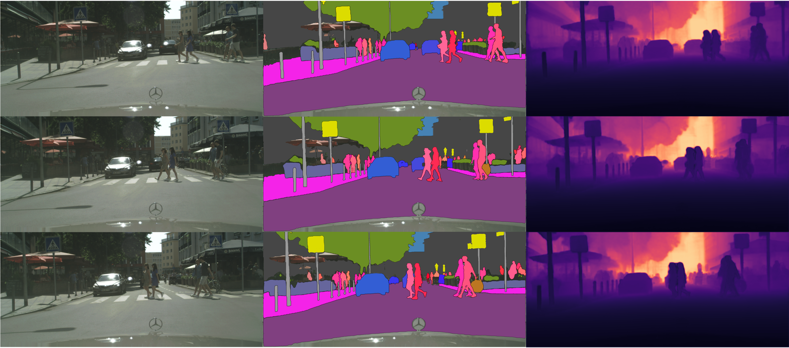

# Uni-DVPS (RA-L 2024)
### [Project Page](https://jiyeon-k1m.github.io/uni-dvps) | [Paper](https://ieeexplore.ieee.org/document/10517661)
This repository contains the official implementation of the RA-L 2024 paper, 
"Uni-DVPS: Unified Model for Depth-Aware Video Panoptic Segmentation".


## Installation
### Requirements
- Ubuntu 18.04 with Python 3.7
- PyTorch 1.9.1
- CUDA 11.1
- Detectron2: [Detectron2 installation instruction](https://detectron2.readthedocs.io/en/latest/tutorials/install.html)
- OpenCV is optional but needed for demo and visualization

### Environment setup
`CUDA_HOME` must be defined and points to the directory of the installed CUDA toolkit.
```shell
conda create --name unidvps python=3.7
conda activate unidvps

# pytorch installation
pip install torch==1.9.1+cu111 torchvision==0.10.1+cu111 -f https://download.pytorch.org/whl/torch_stable.html

# opencv installation
pip install -U opencv-python

# detectron2 installation
git clone --recursive git@github.com:facebookresearch/detectron2.git
cd detectron2
git checkout 1315c8977e867b9979b4fa712638c1975ca8c78f
pip install -e .

pip install git+https://github.com/cocodataset/panopticapi.git
pip install git+https://github.com/mcordts/cityscapesScripts.git

cd ..
git clone https://github.com/postech-ami/Uni-DVPS.git
cd Uni-DVPS
pip install -r requirements.txt
```
### CUDA kernel for MSDeformAttm
After preparing the required environment, run the following command to compile CUDA kernel for MSDeformAttn.

```shell
cd mask2former/modeling/pixel_decoder/ops
sh make.sh
```

## Preparing data
First, download [Cityscapes-DVPS](https://github.com/joe-siyuan-qiao/ViP-DeepLab/blob/master/cityscapes-dvps/README.md) and [SemKITTI-DVPS](https://github.com/joe-siyuan-qiao/ViP-DeepLab/tree/master/semkitti-dvps) datasets.   
Then download dataset json file from [this link](https://drive.google.com/drive/folders/1mVnO-bnwblx9sgPPqtfQ6_zMyky9GpC5?usp=sharing).
The datasets are assumed to exist in a directory specified by the environment variable `DETECTRON2_DATASETS`.

You can set the location of dataset directory by ```export DETECTRON2_DATASETS=/path/to/dataset```.   
If it is unset, the default will be `./datasets` relative to your current working directory.

We follow the format of Detectron2 Custom Datasets. Please refer [this page](https://detectron2.readthedocs.io/en/latest/tutorials/datasets.html) if you want to use your own dataset.   

### Expected dataset structure
```
$DETECTRON2_DATASETS
├── cityscapes-dvps
│   └── video_sequence
│       ├── dvps_cityscapes_val.json
│       └── val
│           ├── 000000_000000_munster_000168_000004_leftImg8bit.png
│           ├── 000000_000000_munster_000168_000004_gtFine_instanceTrainIds.png
│           ├── 000000_000000_munster_000168_000004_depth.png
│           └── ...
└── semkitti-dvps
    └── video_sequence
        ├── dvps_semkitti_val.json
        └── val
            ├── 000008_000000_leftImg8bit.png  
            ├── 000008_000000_gtFine_class.png             
            ├── 000008_000000_gtFine_instance.png
            ├── 000008_000000_depth_707.0911865234375.png
            └── ...
```

### Pretrained models
The trained models are available for download in [this link](https://drive.google.com/drive/folders/1PCIoEbvv6U3Te2M3iZrp9ys2_kDa-Xvm?usp=sharing).

## Getting Start with Uni-DVPS
### Demo
Visualize the results of video panoptic segmentation and depth estimation.
```shell
python demo/demo.py \
--config-file configs/CityscapesDVPS/R50.yaml \
--input /path/to/video/frames \
--output /output/folder \
--opts MODEL.WEIGHTS /path/to/checkpoint_file
```


### Evaluation on Cityscapes-DVPS dataset
You can evaluate the model on Cityscapes-DVPS dataset.
```shell
python train.py \
--config-file configs/CityscapesDVPS/R50.yaml \
--eval-only \
OUTPUT_DIR /output/folder \
MODEL.WEIGHTS /path/to/checkpoint_file
```

### Evaluation on SemKITTI-DVPS dataset

You can evaluate the model on SemKITTI-DVPS dataset.   
Please set the argument `EVAL_FRAMES` among {1, 5, 10, 20}.

```shell
python train.py \
--config-file configs/SemKITTIDVPS/R50.yaml \
--eval-only \
EVAL_FRAMES 5 \
OUTPUT_DIR /output/folder \
MODEL.WEIGHTS /path/to/checkpoint_file
```
## Citation
If you use Uni-DVPS in your research or wish to use our code, please consider citing:
```
@article{jiyeon2024unidvps,
  title={Uni-DVPS: Unified Model for Depth-Aware Video Panoptic Segmentation},
  author={Ji-Yeon, Kim and Hyun-Bin, Oh and Byung-Ki, Kwon and Kim, Dahun and Kwon, Yongjin and Oh, Tae-Hyun},
  journal={IEEE Robotics and Automation Letters},
  year={2024},
  publisher={IEEE}
}
```

## Acknowledgement
The implementation of Uni-DVPS is largely fine-tuned from [Mask2former](https://github.com/facebookresearch/Mask2Former) and [MinVIS](https://github.com/NVlabs/MinVIS).   
Depth-aware Video Panoptic Segmentation datasets are from [ViP-DeepLab](https://github.com/joe-siyuan-qiao/ViP-DeepLab).   
We would like to sincerely thank the authors for generously sharing their code and data.

> This work was supported by Institute of Information & Communications Technology Planning & Evaluation (IITP) grant funded by the Korea government (MSIT) (No. 2020-0-00004, Development of Previsional Intelligence based on Long-term Visual Memory Network) and Institute of Information & communications Technology Planning \& Evaluation (IITP) grant funded by the Korea government(MSIT) (No.2022-0-00290, Visual Intelligence for Space-Time Understanding and Generation based on Multi-layered Visual Common Sense).