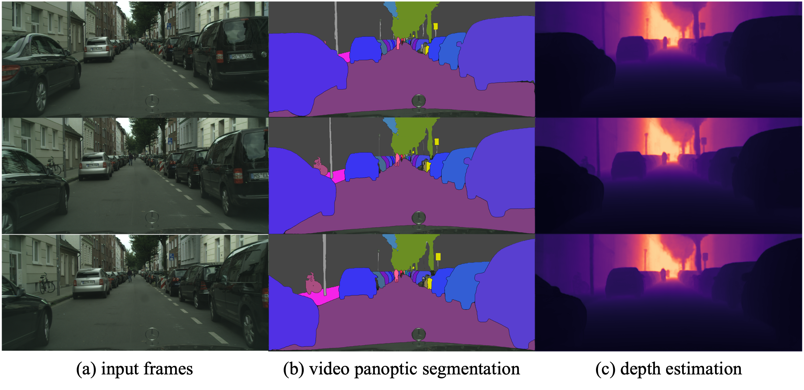

# Uni-DVPS
### [Project Page](https://jiyeon-k1m.github.io/uni-dvps) | [Paper](https://jiyeon-k1m.github.io/uni-dvps)
This repository contains the official implementation of the RA-L 2024 paper, 
"Uni-DVPS: Unified Model for Depth-Aware Video Panoptic Segmentation".

## Acknowledgement
> This work was supported by Institute of Information & Communications Technology Planning & Evaluation (IITP) grant funded by the Korea government (MSIT) (No. 2020-0-00004, Development of Previsional Intelligence based on Long-term Visual Memory Network) and Institute of Information & communications Technology Planning \& Evaluation (IITP) grant funded by the Korea government(MSIT) (No.2022-0-00290, Visual Intelligence for Space-Time Understanding and Generation based on Multi-layered Visual Common Sense).